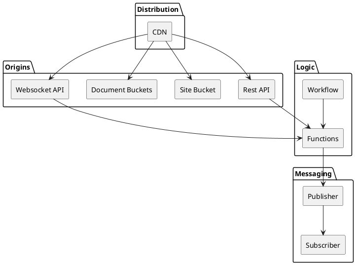

# Cloud Foundry

Cloud Foundry is a curated collection of components that can be assembled to build cloud-centric applications.

# Component Library

Cloud Foundry compoenents are organized into four catagories.


* **Distribution:** 
* * **CDB** - content delivery can be connected to multiple origins (Rest API, Site Bucket, Document Buckets, and WebSocket API).
* **Origins:**
Elements in this layer provide content, consists of backend resources like 
* * **Rest API**, 
* * **Site Bucket**
* * **Document Bucket**
* * **WebSocket API**
, which are the origins that CloudFront interacts with.
* **Logic:** Application logic is implemented using Functions or Workflows
* * **Functions** Performe atomic operations or processes.
* * **Workflows** handles longer processes that span multiple operations.
* **Messaging:** Asynchronous communication is handled by messaging services. Elements provided follow a pub-sub model allowing.
* * **Publisher**
* * **Subscriber**

## Set Up

To get started, you can import the package and use it within your Pulumi project. Below is an example demonstrating how to deploy an AWS REST API along with a Lambda function using Cloud Foundry components.

## Hello World Example

The following example deploys an AWS REST API along with a Lambda function that returns a greeting message.  This implementation consists of three parts.  The API specification, the Function handler, and the Cloud Foundry deployment code.


### 1. API Specification

The first component required to build a REST API with Cloud Foundry is the API specification. This OpenAPI specification serves as the foundation for the API.
When constructing a REST API, integrations with functions must be linked to the path operations defined in the API specification. Additionally, authorizer functions can be associated with the API to provide authentication and authorization for these path operations.

In this example the API specification is a single path operation `/greet`.  This operation accepts an optional query parameter `name` and returns a greeting message. If the `name` parameter is not provided, it defaults to "World."

```yaml
# api_config.yaml
openapi: 3.0.3
info:
  description: A simple API that returns a greeting message.
  title: Greeting API
  version: 1.0.0
paths:
  /greet:
    get:
      summary: Returns a greeting message.
      description: |
        This endpoint returns a greeting message. It accepts an optional
        query parameter `name`. If `name` is not provided, it defaults to "World".
      parameters:
        - in: query
          name: name
          schema:
            type: string
          description: The name of the person to greet.
          example: John
      responses:
        200:
          description: A greeting message.
          content:
            application/json:
              schema:
                type: object
                properties:
                  message:
                    type: string
                    description: The greeting message.
                    example: Hello, John!
        400:
          description: Bad Request - Invalid query parameter.
          content:
            application/json:
              schema:
                type: object
                properties:
                  error:
                    type: string
                    description: A description of the error.
                    example: Invalid query parameter
```

### 2. Lambda Function

In this step, we implement the logic for the path operations of our API.

For the example application, this logic is handled by a Python Lambda function that implements the `/greet` API endpoint. The function retrieves the `name` parameter from the query string and returns a greeting message in JSON format.

```python
# app.py
import json

def handler(event, context):
    print(f"event: {event}")
    # Extract the 'name' parameter from the query string; default to 'World'
    name = (event.get("queryStringParameters", None) or {}).get("name", "World")
    
    # Return a JSON response with the greeting message
    return {
        "statusCode": 200,
        "body": json.dumps({
            "message": f"Hello, {name}!"
        }),
        "headers": {
            "Content-Type": "application/json"
        }
    }
```

### 3. Deploying with Cloud Foundry

The final step in implementing the API is deploying it using Cloud Foundry.

For the example, we need to create a Python function and then set up a `REST_API` with an integration that connects the function to the specified path operation.

Cloud Foundry simplifies much of the process for building functions. For Python functions, you typically only need to specify the sources and requirements. Cloud Foundry then takes care of assembling and deploying the function automatically.

For instance, the function for the `/greet` path operation can be defined as:

```python
greet_function = cloud_foundry.python_function(
    "greet-function", 
    sources={"app.py": "./greet_app.py"}
)
```

In this example, Cloud Foundry copies the file `./greet_app.py` into the function code as `app.py` during the build process.

> Cloud Foundry offers default settings such as the handler, memory size, and others, which can be customized as needed.

Next, we set up a Cloud Foundry `rest_api`. Here, we provide the `api_spec.yaml` file and define an integration between the `/greet` path operation and the `greet-function`. The function is defined inline within the integration.

The complete REST API deployment looks like this:

```python
# __main__.py
greet_api = cloud_foundry.rest_api(
    "greet-oauth-api",
    body="./api_spec.yaml",
    integrations=[
        {
            "path": "/greet",
            "method": "get",
            "function": cloud_foundry.python_function(
                "greet-function", 
                handler="app.handler", 
                sources={"app.py": "./greet_app.py"}
            ),
        },
    ],
)
```


## Conclusion

Cloud Foundry simplifies the process of deploying cloud-native applications by providing easy-to-use components for defining REST APIs and Lambda functions. This example demonstrates how to deploy a basic API that returns a greeting message using Pulumi and Cloud Foundry.