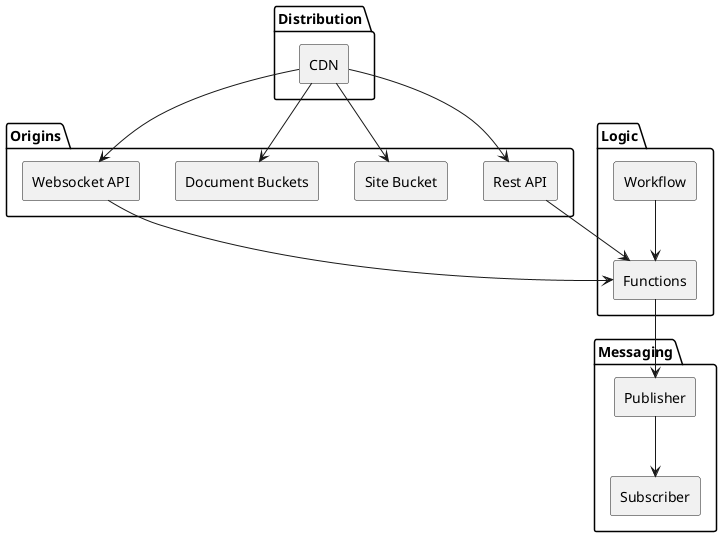

# Cloud Foundry

Cloud Foundry is a curated collection of components that can be assembled to build cloud-centric applications.

# Component Library

Cloud Foundry compoenents are organized into four catagories.


```plantuml
@startuml
skinparam componentStyle rectangle

' Distribution layer
package "Distribution" {
    [CDN] as cdn
}

' Origins layer
package "Origins" {
    [Rest API] as restApi
    [Site Bucket] as siteBucket
    [Document Buckets] as documentBuckets
    [Websocket API] as websocketApi
}

' Logic layer
package "Logic" {
    [Functions] as functions
    [Workflow] as workflow
}

' Messaging layer
package "Messaging" {
    [Publisher] as snsTopic
    [Subscriber] as sqsQueue
}

' Connections
cdn --> restApi
cdn --> siteBucket
cdn --> documentBuckets
cdn --> websocketApi

restApi --> functions
websocketApi --> functions
workflow --> functions

functions --> snsTopic
snsTopic --> sqsQueue

@enduml
```
* **Distribution:**
* * **CDN** - content delivery can be connected to multiple origins (Rest API, Site Bucket, Document Buckets, and WebSocket API).
* **Origins:**
Elements in this layer provide content, consists of backend resources like
* * **Rest API**,
* * **Site Bucket**
* * **Document Bucket**
* * **WebSocket API**
, which are the origins that CloudFront interacts with.
* **Logic:** Application logic is implemented using Functions or Workflows
* * **Functions** Performe atomic operations or processes.
* * **Workflows** handles longer processes that span multiple operations.
* **Messaging:** Asynchronous communication is handled by messaging services. Elements provided follow a pub-sub model allowing.
* * **Publisher**
* * **Subscriber**

## Set Up

To get started, you can import the package and use it within your Pulumi project. Below is an example demonstrating how to deploy an AWS REST API along with a Lambda function using Cloud Foundry components.

## Hello World Example

The following example deploys an AWS REST API along with a Lambda function that returns a greeting message.  This implementation consists of three parts.  The API specification, the Function handler, and the Cloud Foundry deployment code.


### 1. API Specification

The first component required to build a REST API with Cloud Foundry is the API specification. This OpenAPI specification serves as the foundation for the API.
When constructing a REST API, integrations with functions must be linked to the path operations defined in the API specification. Additionally, authorizer functions can be associated with the API to provide authentication and authorization for these path operations.

In this example the API specification is a single path operation `/greet`.  This operation accepts an optional query parameter `name` and returns a greeting message. If the `name` parameter is not provided, it defaults to "World."

```yaml
# api_config.yaml
openapi: 3.0.3
info:
  description: A simple API that returns a greeting message.
  title: Greeting API
  version: 1.0.0
paths:
  /greet:
    get:
      summary: Returns a greeting message.
      description: |
        This endpoint returns a greeting message. It accepts an optional
        query parameter `name`. If `name` is not provided, it defaults to "World".
      parameters:
        - in: query
          name: name
          schema:
            type: string
          description: The name of the person to greet.
          example: John
      responses:
        200:
          description: A greeting message.
          content:
            application/json:
              schema:
                type: object
                properties:
                  message:
                    type: string
                    description: The greeting message.
                    example: Hello, John!
        400:
          description: Bad Request - Invalid query parameter.
          content:
            application/json:
              schema:
                type: object
                properties:
                  error:
                    type: string
                    description: A description of the error.
                    example: Invalid query parameter
```

### 2. Lambda Function

In this step, we implement the logic for the path operations of our API.

For the example application, this logic is handled by a Python Lambda function that implements the `/greet` API endpoint. The function retrieves the `name` parameter from the query string and returns a greeting message in JSON format.

```python
# app.py
import json

def handler(event, context):
    print(f"event: {event}")
    # Extract the 'name' parameter from the query string; default to 'World'
    name = (event.get("queryStringParameters", None) or {}).get("name", "World")

    # Return a JSON response with the greeting message
    return {
        "statusCode": 200,
        "body": json.dumps({
            "message": f"Hello, {name}!"
        }),
        "headers": {
            "Content-Type": "application/json"
        }
    }
```

### 3. Deploying with Cloud Foundry

The final step in implementing the API is deploying it using Cloud Foundry.

For the example, we need to create a Python function and then set up a `REST_API` with an integration that connects the function to the specified path operation.

Cloud Foundry simplifies much of the process for building functions. For Python functions, you typically only need to specify the sources and requirements. Cloud Foundry then takes care of assembling and deploying the function automatically.

For instance, the function for the `/greet` path operation can be defined as:

```python
greet_function = cloud_foundry.python_function(
    "greet-function",
    sources={"app.py": "./greet_app.py"}
)
```

In this example, Cloud Foundry copies the file `./greet_app.py` into the function code as `app.py` during the build process.

> Cloud Foundry offers default settings such as the handler, memory size, and others, which can be customized as needed.

Next, we set up a Cloud Foundry `rest_api`. Here, we provide the `api_spec.yaml` file and define an integration between the `/greet` path operation and the `greet-function`. The function is defined inline within the integration.

The complete REST API deployment looks like this:

```python
# __main__.py
greet_api = cloud_foundry.rest_api(
    "greet-oauth-api",
    specification="./api_spec.yaml",
    integrations=[
        {
            "path": "/greet",
            "method": "get",
            "function": cloud_foundry.python_function(
                "greet-function",
                handler="app.handler",
                sources={"app.py": "./greet_app.py"}
            ),
        },
    ],
)
```


## Conclusion

Cloud Foundry simplifies the process of deploying cloud-native applications by providing easy-to-use components for defining REST APIs and Lambda functions. This example demonstrates how to deploy a basic API that returns a greeting message using Pulumi and Cloud Foundry.

# Cloud Foundry API Reference

## `Function` (Component Resource)

The `Function` class creates an AWS Lambda function resource with additional configuration options, such as memory size, timeout, environment variables, and optional VPC configuration. This class allows creating a new Lambda function or importing an existing one based on the provided parameters.

### Example Usage

```python
import pulumi
from cloud_foundry.function import Function

# Example of creating a new Lambda function
lambda_function = Function(
    name="my-lambda-function",
    archive_location="path/to/lambda-code.zip",
    handler="app.handler",
    runtime="python3.9",
    memory_size=256,
    timeout=60,
    environment={"MY_ENV_VAR": "my-value"},
    vpc_config={
        "subnet_ids": ["subnet-12345678", "subnet-87654321"],
        "security_group_ids": ["sg-12345678"]
    }
)
```

### Constructor

```python
def __init__(
    self,
    name,
    *,
    archive_location: str = None,
    hash: str = None,
    runtime: Optional[str] = None,
    handler: Optional[str] = None,
    timeout: Optional[int] = None,
    memory_size: Optional[int] = None,
    architectures: Optional[list[str]] = None,
    environment: dict[str, Union[str, pulumi.Output[str]]] = None,
    policy_statements: Optional[PolicyStatementsInput] = None,
    vpc_config: Optional[dict] = None,
    opts=None,
)
```

#### Parameters

- `name` (`str`) – The name of the Lambda function. This will be used as part of the function's identifier.

- `archive_location` (`str`, optional) – Path to the zip file containing the Lambda function's code.

- `hash` (`str`, optional) – A hash of the Lambda function's code to manage changes.

- `runtime` (`str`, optional) – The runtime environment for the Lambda function (e.g., `python3.9`).

- `handler` (`str`, optional) – The handler method to be used as the entry point for the Lambda function (e.g., `app.handler`).

- `timeout` (`int`, optional) – The amount of time that Lambda allows a function to run before stopping it. The default is 3 seconds.

- `memory_size` (`int`, optional) – The amount of memory (in MB) allocated to the Lambda function. The default is 128 MB.

- `architectures` (`list[str]`, optional) – The instruction set architecture(s) for the Lambda function (e.g., `["x86_64"]` or `["arm64"]`).

- `environment` (`dict[str, str]`, optional) – Key-value pairs of environment variables to set for the Lambda function.

- `policy_statements` (`list[dict]`, optional) – Additional IAM policy statements (each with `Effect`, `Action`/`Actions`, and `Resource`/`Resources` keys) to attach to the Lambda function's execution role.

- `vpc_config` (`dict`, optional) – Configuration for the VPC settings of the Lambda function, such as:
  - `subnet_ids` (`list[str]`) – The list of subnet IDs for the VPC configuration.
  - `security_group_ids` (`list[str]`) – The list of security group IDs for the VPC configuration.

- `opts` (`pulumi.ResourceOptions`, optional) – Additional options that control the behavior of this resource.

#### Properties

- `invoke_arn` (`pulumi.Output[str]`) – The ARN of the Lambda function's invoke URL.

- `function_name` (`pulumi.Output[str]`) – The name of the created Lambda function.

### Methods

### `function` Helper Method

The `function` helper method provides a simplified interface to create a new Lambda function using the `Function` class.

```python
def function(
    name,
    *,
    archive_location: str = None,
    hash: str = None,
    runtime: str = None,
    handler: str = None,
    timeout: int = None,
    memory_size: int = None,
    environment: dict[str, str] = None,
    policy_statements: list = None,
    vpc_config: dict = None,
    opts=None,
) -> Function:
```

#### Example Usage

```python
import cloud_foundry

lambda_function = cloud_foundry.function(
    name="my-lambda-function",
    archive_location="path/to/lambda-code.zip",
    handler="app.handler",
    runtime="python3.9",
    memory_size=256,
    timeout=60,
    environment={"MY_ENV_VAR": "my-value"},
    vpc_config={
        "subnet_ids": ["subnet-12345678", "subnet-87654321"],
        "security_group_ids": ["sg-12345678"]
    }
)
```

#### Parameters

Refer to the `Function` constructor parameters, as the helper method accepts the same arguments and passes them to the `Function` class.

---

### Outputs

The Lambda function creates the following outputs:

- **`invoke_arn`** – The ARN that can be used to invoke the Lambda function.
- **`function_name`** – The name of the Lambda function.


### `python_function`

Creates an AWS Lambda function using Python with source code and dependencies packaged together.

The `python_function` component is responsible for creating and deploying an AWS Lambda function using Python source code. This function wraps the creation of a Lambda function by first packaging the source code and any required Python dependencies using the `PythonArchiveBuilder` and then deploying it via Pulumi's AWS Lambda resources.

#### Example Usage

```python
import pulumi
import cloud_foundry

# Create a Lambda function
lambda_function = cloud_foundry.python_function(
    name="example-function",
    handler="app.handler",  # Lambda handler function (app.py's handler function)
    memory_size=128,  # Memory size for the Lambda
    timeout=60,  # Timeout in seconds
    sources={
      "app.py": "./app.py",  # Source files
    },
    requirements = [
      "requests==2.27.1",  # Python package dependencies
    ],
    environment={
        "MY_ENV_VAR": "value",  # Environment variables for the Lambda
    },
)
```

#### Arguments

| Name           | Type             | Description                                                                                               |
|----------------|------------------|-----------------------------------------------------------------------------------------------------------|
| `name`         | `str`            | The name of the AWS Lambda function to create.                                                            |
| `handler`      | `str`, optional   | The entry point for the Lambda function, specified as `file_name.function_name`. Defaults to"app.handler"   |
| `memory_size`  | `int`, optional   | The memory allocated to the Lambda function in MB. Defaults to AWS Lambda's standard memory size.          |
| `timeout`      | `int`, optional   | The maximum amount of time that the Lambda function can run, in seconds. Defaults to AWS Lambda's timeout. |
| `sources`      | `dict[str, str]`, optional | A dictionary of source files or inline code to include in the Lambda. The keys are destination paths, and the values are the source file paths or inline code. |
| `requirements` | `list[str]`, optional | A list of Python package dependencies to include. These are installed and packaged with the function.     |
| `environment`  | `dict[str, str]`, optional | Environment variables to pass to the Lambda function.                                                    |

#### Returns

- `Function`: An instance of the `Function` class representing the deployed Lambda function, including properties like `invoke_arn` and `function_name`.

#### Components

- **`PythonArchiveBuilder`**: Packages the Python source files and dependencies into a deployable archive for the Lambda function.
- **`Function`**: A Pulumi `ComponentResource` that defines and manages the AWS Lambda function deployment.

#### Attributes

| Name            | Description                                                        |
|-----------------|--------------------------------------------------------------------|
| `invoke_arn`    | The ARN used to invoke the deployed Lambda function.               |
| `function_name` | The name of the deployed Lambda function.                          |

#### Resources Created

- **AWS Lambda Function**: A new Lambda function created with the given source files, dependencies, memory size, timeout, handler, and environment variables.
- **IAM Role**: The required IAM role is created to grant the Lambda function execution permissions.

#### Notes

- **Memory Size and Timeout**: You can customize the memory size and timeout for the Lambda function. AWS charges are affected by these values.
- **Sources and Requirements**: The `sources` argument is used to include Python source code, and `requirements` is used to specify the dependencies to be installed in the Lambda function environment.
- **Environment Variables**: The `environment` argument allows you to set environment variables for the Lambda function at runtime.

#### See Also

- [Pulumi AWS Lambda Function](https://www.pulumi.com/docs/reference/pkg/aws/lambda/function/)
- [AWS Lambda Documentation](https://docs.aws.amazon.com/lambda/)

## `rest_api` (Helper Function)

The `rest_api` function creates and manages an AWS API Gateway REST API with Lambda integrations and token validators. Define your API using an OpenAPI specification and attach Lambda functions to specific path operations. Token validators (Lambda-backed or Cognito user-pool based) provide authentication and authorization.

### Function Signature

```python
def rest_api(
    name: str,
    specification: Union[str, list[str]] = None,
    integrations: list[dict] = None,
    cors_origins: str = False,
    token_validators: list[dict] = None,
    content: list[dict] = None,
    hosted_zone_id: str = None,
    subdomain: str = None,
    firewall: dict = None,
    enable_logging: Optional[bool] = False,
    path_prefix: Optional[str] = None,
    export_api: Optional[str] = None,
    opts: Optional[pulumi.ResourceOptions] = None,
) -> RestAPI
```

### Parameters

- `name` (str): The name of the REST API.
- `specification` (str or list[str]): The OpenAPI specification, as a file path or YAML content. A list merges multiple spec fragments together.
- `integrations` (list[dict], optional): Lambda integrations for path operations. Each entry:
  - `path` (str): The API path to integrate with the Lambda function.
  - `method` (str): The HTTP method for the path.
  - `function` (cloud_foundry.Function): The Lambda function to integrate.
- `cors_origins` (str or list[str], optional): If set, enables CORS on every path in the spec and allows the given origin(s).
- `token_validators` (list[dict], optional): Authorizers for authentication. Each entry needs a unique `name` and exactly one of:
  - `function` (cloud_foundry.Function): A Lambda-backed token validator, or
  - `user_pools` (list[str]): Cognito user pool ARNs for a pool-based validator.
- `content` (list[dict], optional): S3 content integrations (`bucket_name`, `path`, `prefix`, etc.) served directly through the API.
- `hosted_zone_id` (str, optional): Route 53 hosted zone ID; when set, a custom domain is created for the API.
- `subdomain` (str, optional): Subdomain to use for the custom domain (defaults to a name derived from `name`).
- `firewall` (dict, optional): WAF configuration, forwarded to `RestAPIFirewall` (see `cloud_foundry.pulumi.api_waf`) — e.g. `{"block_sql_injection": True, "rate_limit": 2000}`. When set, a regional WAF Web ACL is created and attached to the API's stage.
- `enable_logging` (bool, optional): Enable API Gateway stage access logging to CloudWatch.
- `path_prefix` (str, optional): A prefix prepended to every path in the spec.
- `export_api` (str, optional): Write the resolved OpenAPI spec to a local file path or an `s3://bucket/key` location.
- `opts` (pulumi.ResourceOptions, optional): Options to control the resource's behavior.

### Example Usage

```python
import cloud_foundry

greet_api = cloud_foundry.rest_api(
    name="greet-api",
    specification="./api_spec.yaml",
    integrations=[
        {
            "path": "/greet",
            "method": "get",
            "function": cloud_foundry.python_function(
                name="greet-function",
                handler="app.handler",
                sources={"app.py": "./greet_app.py"},
            ),
        }
    ],
    token_validators=[
        {
            "name": "token-authorizer",
            "function": cloud_foundry.import_function("token-authorizer"),
        }
    ],
)
```

### Outputs

- `rest_api_id` (`pulumi.Output[str]`) – The ID of the created API Gateway REST API.
- `stage_name` (`pulumi.Output[str]`) – The name of the deployed API Gateway stage.
- `domain` (`pulumi.Output[str]`) – The host URL of the API (custom domain if `hosted_zone_id` is set, otherwise the default `execute-api` endpoint).

# `document_repository` Function Documentation
The `document_repository` function is a utility designed to create a centralized document repository. It enables clients and services to store, retrieve, and manage documents efficiently within an S3 bucket.

This repository simplifies handling document-related operations by providing optional event notifications that can trigger Lambda functions or workflows. The function streamlines the setup process by creating the S3 bucket, configuring Lambda triggers, and managing the required IAM permissions.

## Function Signature

```python
def document_repository(name, bucket_name: str = None, notifications=None, opts=None):
    return DocumentRepository(name, bucket_name, notifications, opts)
```

---

## Parameters

1. **`name`** (str, required):
   - The name of the document repository.
   - This name is used to create the S3 bucket and associated resources.

2. **`bucket_name`** (str, optional):
   - The name of the S3 bucket to be created.
   - If not provided, a default name is generated using the format: `<project>-<stack>-<name>`.

3. **`notifications`** (list of dict, optional):
   - A list of notification configurations for Lambda triggers.
   - Each notification is a dictionary with the following keys:
     - **`function`** (required): The Lambda function to trigger.
     - **`prefix`** (optional): A prefix filter for the S3 object key (e.g., `"uploads/"`).
     - **`suffix`** (optional): A suffix filter for the S3 object key (e.g., `".jpg"`).

4. **`opts`** (pulumi.ResourceOptions, optional):
   - Additional options for the Pulumi resource, such as parent-child relationships or custom dependencies.

---

## Returns

- An instance of the `DocumentRepository` class, which includes:
  - The created S3 bucket.
  - Configured Lambda notifications (if provided).
  - IAM role and permissions for the Lambda functions.

---

## Features

1. **S3 Bucket Creation**:
   - Creates an S3 bucket with the specified or default name.

2. **Lambda Notifications**:
   - Configures S3 bucket notifications to trigger Lambda functions on specific events (e.g., object creation or deletion).
   - Supports prefix and suffix filters for fine-grained control over which objects trigger the Lambda function.

3. **IAM Role Management**:
   - Automatically creates an IAM role for the Lambda function with the necessary permissions.

4. **Pulumi Integration**:
   - Fully integrated with Pulumi, allowing for seamless infrastructure as code (IaC) management.

---

## Example Usage

### Basic S3 Bucket Creation

```python
from cloud_foundry.pulumi.document_repository import document_repository

# Create a simple S3 bucket
bucket = document_repository(name="my-doc-repo")
```

### S3 Bucket with Lambda Notifications

```python
from cloud_foundry.pulumi.document_repository import document_repository
from pulumi_aws import lambda_

# Define a Lambda function
my_lambda = lambda_.Function(
    "my-lambda",
    runtime="python3.9",
    handler="handler.main",
    code=pulumi.AssetArchive({
        ".": pulumi.FileArchive("./lambda_code"),
    }),
)

# Create an S3 bucket with Lambda notifications
bucket = document_repository(
    name="my-doc-repo",
    notifications=[
        {
            "function": my_lambda,
            "prefix": "uploads/",
            "suffix": ".jpg",
        }
    ],
)
```

### Custom Bucket Name

```python
bucket = document_repository(
    name="my-doc-repo",
    bucket_name="custom-bucket-name",
)
```

---

## Generated Resources

1. **S3 Bucket**:
   - A new S3 bucket is created with the specified or default name.

2. **Bucket Notifications**:
   - Configures S3 bucket notifications to trigger Lambda functions on specified events.

3. **IAM Role**:
   - An IAM role is created for the Lambda function with the necessary permissions.

4. **Lambda Permissions**:
   - Grants the S3 bucket permission to invoke the Lambda function.

---

## Best Practices

1. **Use Prefix and Suffix Filters**:
   - Use `prefix` and `suffix` filters to limit the objects that trigger the Lambda function, reducing unnecessary invocations.

2. **Secure IAM Roles**:
   - Ensure that the IAM role created for the Lambda function has only the necessary permissions.

3. **Test Lambda Functions**:
   - Test the Lambda functions independently before attaching them to the S3 bucket to ensure they handle events correctly.

---

## Limitations

1. **Single Bucket**:
   - This function creates a single S3 bucket. For multiple buckets, you need to call the function multiple times.

2. **Notification Configuration**:
   - Notifications are limited to the events and filters supported by S3.

---

## Conclusion

The `document_repository` function simplifies the creation of an S3 bucket with optional Lambda notifications and IAM role management. It is a powerful tool for managing document repositories in AWS using Pulumi.


### **`cdn` Function Documentation**

The `cdn` function is a utility for creating a Content Delivery Network (CDN) using AWS CloudFront, Route 53, and ACM (AWS Certificate Manager). It simplifies the process of deploying a CDN for serving static websites, APIs, and other content with custom domains, SSL/TLS certificates, and advanced caching and logging features.

---

#### **Function Signature**

```python
def cdn(
    name: str,
    origins: list[dict],
    hosted_zone_id: Optional[str] = None,
    subdomain: Optional[str] = None,
    site_domain_name: Optional[str] = None,
    error_responses: Optional[list] = None,
    create_apex: Optional[bool] = False,
    root_uri: Optional[str] = None,
    logging_bucket: Optional[str] = None,
    opts: ResourceOptions = None,
) -> CDN
```

---

#### **Parameters**

1. **`name`** (str, required):
   - The name of the CDN resource.
   - Used to name the CloudFront distribution, Route 53 records, and other associated resources.

2. **`origins`** (list[dict], required):
   - A unified list of origin configurations served by the CDN. Each entry is a dict with:
     - `name` (str): Unique identifier for the origin.
     - `bucket` (aws.s3.Bucket): An S3 bucket, for a static-site origin.
     - `domain_name` (str): A custom domain name, for a domain-based API origin.
     - `rest_api` (RestAPI or aws.apigateway.RestApi): A REST API origin.
     - `path_pattern` (str, optional): Path pattern for the cache behavior (e.g., `"/api/*"`), used by API/domain origins.
     - `origin_path` (str, optional): Path prefix on the origin.
     - `origin_shield_region` (str, optional): AWS region for Origin Shield.
     - `is_target_origin` (bool, optional): Marks this origin as the distribution's default origin.
     - `api_key_password` (str, optional): API key sent as a custom header (REST API origins only).

3. **`hosted_zone_id`** (str, optional):
   - The Route 53 hosted zone ID for managing DNS records. Required for a custom domain.

4. **`subdomain`** (str, optional):
   - The subdomain for the CDN distribution (e.g., `"www"`, `"cdn"`). Defaults to the current Pulumi stack name.

5. **`site_domain_name`** (str, optional):
   - The base domain name, used when `create_apex` is set (e.g., `example.com`).

6. **`error_responses`** (list, optional):
   - Custom error responses for the CloudFront distribution.

7. **`create_apex`** (bool, optional):
   - Whether to create an apex domain A record (e.g., `example.com`).
   - Defaults to `False`.

8. **`root_uri`** (str, optional):
   - The default root object for the CDN (e.g., `index.html`).

9. **`logging_bucket`** (str, optional):
   - An S3 bucket (e.g., `"my-logs.s3.amazonaws.com"`) to receive CloudFront access logs. Logging is disabled if omitted.

> `whitelist_countries` and `blacklist_countries` (geo-restriction) are currently only available on the lower-level `CDNArgs`/`CDN` class, not the `cdn()` factory function shown above.

---

#### **Returns**

- An instance of the `CDN` class, which includes:
  - The created CloudFront distribution.
  - Configured Route 53 DNS records.
  - ACM certificates for HTTPS.
  - S3 bucket for logging (if enabled).

---

#### **Features**

1. **CloudFront Distribution**:
   - Configures a CloudFront distribution to serve content from S3 buckets or APIs.
   - Supports custom caching, geo-restrictions, and error responses.

2. **Custom Domains**:
   - Configures Route 53 DNS records and ACM certificates for custom domains (e.g., `example.com` and `www.example.com`).

3. **SSL/TLS Certificates**:
   - Automatically provisions ACM certificates for HTTPS.

4. **Logging**:
   - Creates an S3 bucket for storing CloudFront logs.

5. **Multi-Origin Support**:
   - Supports multiple origins, including static sites and APIs.

6. **Geo-Restrictions**:
   - Restricts access to specific countries.

---

#### **Example Usage**

##### **Basic CDN Setup**

```python
from cloud_foundry.pulumi.cdn import cdn

cdn_instance = cdn(
    name="my-cdn",
    origins=[
        {"name": "static-site", "bucket": site_bucket, "is_target_origin": True},
        {"name": "my-api", "rest_api": my_api_gateway, "path_pattern": "/api/*"},
    ],
    hosted_zone_id="Z1234567890ABC",
    site_domain_name="example.com",
    create_apex=True,
    root_uri="index.html",
)
```

##### **CDN for Static Sites Only**

```python
cdn_instance = cdn(
    name="static-cdn",
    origins=[
        {"name": "static-site", "bucket": site_bucket, "is_target_origin": True},
    ],
    hosted_zone_id="Z1234567890ABC",
    site_domain_name="static.example.com",
)
```

##### **CDN with Geo-Restrictions**

Geo-restriction (`whitelist_countries`) is only available via the lower-level `CDN`/`CDNArgs` classes:

```python
from cloud_foundry.pulumi.cdn import CDN, CDNArgs

cdn_instance = CDN(
    "geo-restricted-cdn",
    CDNArgs(
        origins=[
            {"name": "restricted-site", "bucket": site_bucket, "is_target_origin": True},
        ],
        hosted_zone_id="Z1234567890ABC",
        site_domain_name="restricted.example.com",
        whitelist_countries=["US", "CA", "GB"],
    ),
)
```

---

#### **Best Practices**

1. **Use Custom Domains**:
   - Configure `site_domain_name` and `hosted_zone_id` to serve content with custom domains.

2. **Enable Logging**:
   - Use the logging bucket to monitor and debug CDN traffic.

3. **Optimize Caching**:
   - Configure caching behaviors to improve performance and reduce costs.

4. **Restrict Access**:
   - Use `whitelist_countries` to restrict access to specific regions.

---

#### **Limitations**

1. **Single Hosted Zone**:
   - The implementation assumes all domains are managed within a single Route 53 hosted zone.

2. **Static and API Origins**:
   - Supports static sites and APIs as origins but does not include advanced origin failover configurations.

---

#### **Conclusion**

The `cdn` function simplifies the deployment of a Content Delivery Network using AWS CloudFront, Route 53, and ACM. It supports static sites, APIs, custom domains, and advanced features like logging and geo-restrictions. This function is ideal for building scalable, secure, and performant web applications.
