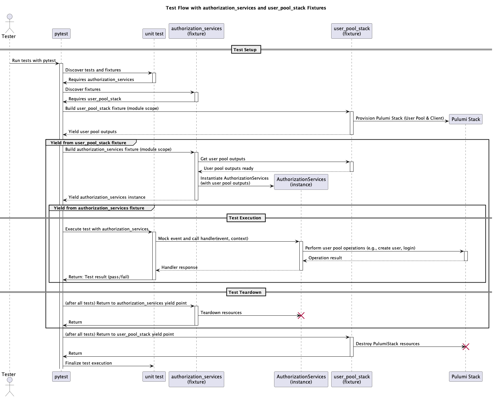

# Testing AWS Lambda Handlers with Pulumi and Pytest: Provisioning Real Cloud Infrastructure for Reliable Validation

Testing AWS Lambda function handlers in isolation usually relies on mocking infrastructure interactions, but the behavior of those mocks may not accurately reflect real AWS services. As a result, tests can miss subtle integration issues or configuration problems that only appear in production. To address this, you can use Pulumi automation to provision actual cloud infrastructure, such as Cognito user pools, for the duration of your tests. This approach enables your Lambda handler code to interact with real AWS services, providing a more accurate and robust validation of your service logic.

In this guide, you'll see how to combine Pulumi automation and Pytest to create, use, and tear down AWS resources dynamically as part of your test suite. By provisioning infrastructure on demand, you can run tests against real cloud components without the overhead of manual deployment, ensuring your code behaves as expected in production, like conditions.

There are three parts to the process;

* Pulumi automation is integrated with pytest fixtures to provide a framework for deploying and destroying AWS resources needed for tests.
* Lambda function configuration is typically managed via environment variables, which can complicate testing; this guide demonstrates a handler implementation that overcomes these issues.
* A pytest fixture is provided to instantiate and directly invoke the Lambda service handler, with examples showing how to use it in your tests.

## How the Test Infrastructure Works

In this example, we are testing an authorization Lambda service that manages users and sessions using a Cognito User Pool. To enable realistic testing, two key pytest fixtures are used:

- `user_pool_stack`: Provisions the required AWS resources (such as the Cognito User Pool) using Pulumi.
- `authorization_services`: Configures and provides an instance of the Lambda service handler, using the outputs from `user_pool_stack`.

The following sequence diagram shows how these fixtures work together: first, resources are provisioned; then, the service handler is configured and made available for tests; finally, all resources are automatically cleaned up after the tests complete.



## Provision AWS Test Resources

In this example we want to test a Lambda handler that interacts with AWS Cognito service, specifically User Pools.

```python
def user_pool_pulumi():
    def pulumi_program():
        user_pool = UserPool(
            "security-user-pool",
            self_serve=True,
            attributes=["username", "nickName"],
            groups=[
                {"description": "Admins group", "role": "admin"},
                {"description": "Manager group", "role": "manager"},
                {"description": "Member group", "role": "member"},
            ],
        )
        log.info("Security API and User Pool created successfully.")
        pulumi.export("user-pool-id", user_pool.id)
        pulumi.export("user-pool-client-id", user_pool.client_id)
        pulumi.export("user-pool-client-secret", user_pool.client_secret)

    return pulumi_program


@pytest.fixture(scope="module")
def user_pool_stack():
    yield from deploy_stack("cf", "security-func", user_pool_pulumi())
```

The deploy_stack function is designed to provision cloud resources for testing using Pulumi, and then automatically clean up those resources when the test is done.

This is accomplished using a `try...finally` block in combination with `yield`. First, the resources defined in the `pulumi_program` are provisioned. Control is then yielded, allowing dependent tests or fixtures to run. After the tests complete, the `finally` block ensures that all resources are destroyed and the stack is removed, guaranteeing cleanup regardless of test outcomes.

The `user_pool_stack` function is defined as a Pytest fixture that wraps the `deploy_stack` function. By using the `@pytest.fixture` decorator, `user_pool_stack` becomes available for injection into test functions or other fixtures. It calls `deploy_stack`, passing in the project and stack names along with the Pulumi program, and then yields control to the test. This setup ensures that the AWS resources are provisioned before the test runs and are automatically cleaned up afterward, providing a reliable and isolated test environment.

```python
def deploy_stack(project_name, stack_name, pulumi_program):
    stack = auto.create_or_select_stack(
        stack_name=stack_name,
        project_name=project_name,
        program=pulumi_program,
    )
    try:
        up_result = stack.up()
        yield stack, up_result.outputs
    finally:
        stack.destroy()
        stack.workspace.remove_stack(stack_name)
```

## Prepare the Lambda Code

It's important to consider how Lambda configuration is managed. Typically, environment variables are used to pass configuration to Lambda functions. While it's possible to set these variables during fixture setup, this approach can be limiting. Different tests may require different configurations, making it difficult to run tests in parallel and increasing the risk of configuration conflicts.

A more flexible approach is to encapsulate the Lambda logic within a Python class. This allows configuration to be provided at instantiation time, enabling the creation of multiple service instances with different settings for each test scenario.

Below is an example of such a service class. If a configuration attribute is not provided during instantiation, the class falls back to using the corresponding environment variable.

```python

class AuthorizationServices:
    def __init__(
        self,
        user_pool_id=None,
        client_id=None,
        client_secret=None,
    ):
        self.user_pool_id = user_pool_id or os.getenv("USER_POOL_ID")
        self.client_id = client_id or os.getenv("CLIENT_ID")
        self.client_secret = client_secret or os.getenv("USER_ADMIN_GROUP")

    def handler(self, event, context):
        log.info(f"event: {event}")

    # additional implementation
```

AWS Lambda requires a handler function as the entry point for execution. The following code snippet demonstrates how to expose a handler function in the handler module. Here, an instance of the service class is created using the default environment variables defined in the Lambda deployment. This ensures that when Lambda invokes the handler, it uses the appropriate configuration from the environment.


```python
authorization_services = AuthorizationServices()

def handler(event, context):
    log.info(f"Received event: {event}")
    return authorization_services.handler(event, context)

```

Now with the handler code configured to allow multiple instances the services fixture can be defined.

## Provision the Lambda Service Instance

Next, define a fixture that provides a fully configured instance of the Lambda service class for your tests. This fixture, like `user_pool_stack`, uses module scope to ensure resources are set up and torn down only once per test module. It takes the outputs from the `user_pool_stack` fixture, such as the Cognito user pool ID and client credentials, and uses them to instantiate the `AuthorizationServices` class. The fixture then yields this instance, making it available to any test that requires it.

> **Note:** Pytest handles fixture teardown in reverse order of setup. When a fixture depends on another (as `authorization_services` depends on `user_pool_stack`), teardown cascades: first, `authorization_services` is finalized, then `user_pool_stack` is torn down. This ensures that resources are released in the correct order and avoids resource leaks or dependency issues during cleanup.


```python
@pytest.fixture(scope="module")
def authorization_services(user_pool_stack):
    stack, outputs = user_pool_stack
    log.info(f"Stack outputs: {outputs}")
    service = AuthorizationServices(
        user_pool_id=outputs.get("user-pool-id").value,
        client_id=outputs.get("user-pool-client-id").value,
        client_secret=outputs.get("user-pool-client-secret").value,
        user_admin_group="admin",
        user_default_group="member",
    )
    yield service
```

## Build the Function Tests

With a `authorization_services` in place tests can be written by injecting the `authorization_services` instance into the test.  With that instance the handler function can then be invoked directly.  Thus a typical test will mock up the Lambda event invoke the handler function and then check the response.


Here is a minimal test implementation.

```python
def test_create_user(authorization_services):
    # mock up event
    event = {
        "resource": "/users",
        "httpMethod": "POST",
        "body": json.dumps({
            "username": f"apitestadmin_{uuid.uuid4()}@example.com",
            "password": "Temp123456!",
        })
    }

    # invoke handler
    response = authorization_services.handler(event, None)

    #check response
    assert response["statusCode"] == 200
```

## Summary

This guide demonstrates how to use Pulumi automation and Pytest to provision real AWS resources, such as Cognito user pools, for Lambda handler testing. By dynamically creating and tearing down infrastructure during tests, you can validate Lambda logic against actual AWS services, ensuring production, like reliability. The approach uses Pytest fixtures to manage resource lifecycles and service configuration, enabling isolated, flexible, and robust testing of AWS Lambda handlers.
